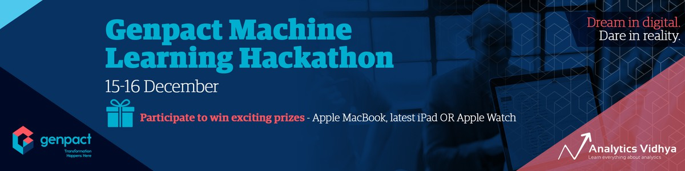

# Genpact-Machine-Learning-Hackathon (Analytics Vidhya)

## Introduction: 
Genpact and Analytics Vidhya presents the “Genpact Machine Learning Hackathon 2018”. A great opportunity to showcase your machine learning and analytical abilities and compete with the best data scientists out there.

## Problem Statement

Predicting the number of orders a particular center would receive in following weeks based on the data of previous weeks.

A Binary Classification Problem for user ad-clicks, in which data pertaining to User Demographics, User actions and Historical logs of the user are provided for some Product id's.

## Leaderboard
* **Public LB : 163th Rank**
* **Private LB : 153th Rank**

### Link to hackathon
https://datahack.analyticsvidhya.com/contest/genpact-machine-learning-hackathon/

#### Public Profile
https://datahack.analyticsvidhya.com/user/profile/himanshu383
